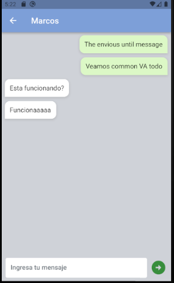

# Chat-App
Flutter's application basic chat app for private communication, the application has 2 core views, a list of all users, and a chat screen; it uses clean architecture, state management with Provider State, and automatic code generation using libraries such as Auto-Route

> ## Getting Started
- [SDK Verion](https://github.com/jorgecasanovadev/chat-app#sdk-version): SDK version
- [How to use](https://github.com/jorgecasanovadev/chat-app/tree/main#how-to-use): Initialize App
- [Libraries and Tools](https://github.com/jorgecasanovadev/chat-app#libraries--tools-used): Libraries and tools used
- [Screenshots](https://github.com/jorgecasanovadev/chat-app/tree/main#screenshot-screens): Screenshots of the app views

<hr align"center">

> ### SDK Version
```dart
~ % flutter --version
Flutter 3.13.8 • channel stable • https://github.com/flutter/flutter.git
Framework • revision 6c4930c4ac (6 days ago) • 2023-10-18 10:57:55 -0500
Engine • revision 767d8c75e8
Tools • Dart 3.1.4 • DevTools 2.25.0

~ % flutter doctor
Doctor summary (to see all details, run flutter doctor -v):
[✓] Flutter (Channel stable, 3.13.8, on macOS 14.0 23A344 darwin-arm64, locale en-US)
[✓] Android toolchain - develop for Android devices (Android SDK version 34.0.0)
[✓] Xcode - develop for iOS and macOS (Xcode 15.0.1)
[✓] Chrome - develop for the web
[✓] Android Studio (version 2022.2)
[✓] VS Code (version 1.83.1)
[✓] Connected device (3 available)
[✓] Network resources

• No issues found!
```
<hr align"center">

> ### How to Use 

**Step 1: 🧑🏻‍💻**
- Download or clone this repo by using the link below:
```
git@github.com:jorgecasanovadev/chat-app.git
```
```
https://github.com/jorgecasanovadev/chat-app.git
```
**Step 2: 🤓**
- Go to the project root and execute the following command in the console to get the required dependencies: 
```
flutter clean
flutter pub get 
```
**Step 3: 🧙🏼‍♂️**
- This project works with code generation, execute the following command to generate files:
```
flutter packages pub run build_runner build --delete-conflicting-outputs
```
<hr align"center">


> ### Libraries & Tools Used

* [Firebase-Core](https://pub.dev/packages/firebase_core) (Firebase core implementation)
* [Firebase-Auth](https://pub.dev/packages/firebase_auth) (Firebase auth for authentication)
* [Provider](https://pub.dev/packages/provider) (State management)
* [Flutter_Logs](https://pub.dev/packages/flutter_logs) (Capture and management of logs)
* [Flutter_Launcher Icons](https://pub.dev/packages/flutter_launcher_icons) (Generate the application icon logo)
* [Flutter_Toast](https://pub.dev/packages/fluttertoast) (Show toast)
* [Auto_Route](https://pub.dev/packages/auto_route) (Declarative routing solution)
* [Easy_Localization](https://pub.dev/packages/easy_localization) (Easy and fast internationalizing and localization)
<hr align"center">

> ### Screenshot Screens

#### Login and Register Screen


- Login and register views inside the auth screen to check between them.
```
modules/
   |- auth/
      |- helpers/
         |- auth_shared_preferences.dart
      |- views/
         |- login_view.dart
         |- register_view.dart
      |- auth_screen.dart
```
<hr align"center">
<br>

#### Home Screen


- This is the home screen inside of the app.
```
modules/
   |- home/
      |- home_screen.dart
```
<br>
<br>
<br>
<br>
<br>
<hr align"center">


#### Chat Screen



- The chat screen to send and receive messages.
```
modules/
   |- screens/
      |- home/
         |- chat-screen.dart
```
<hr align"center">

